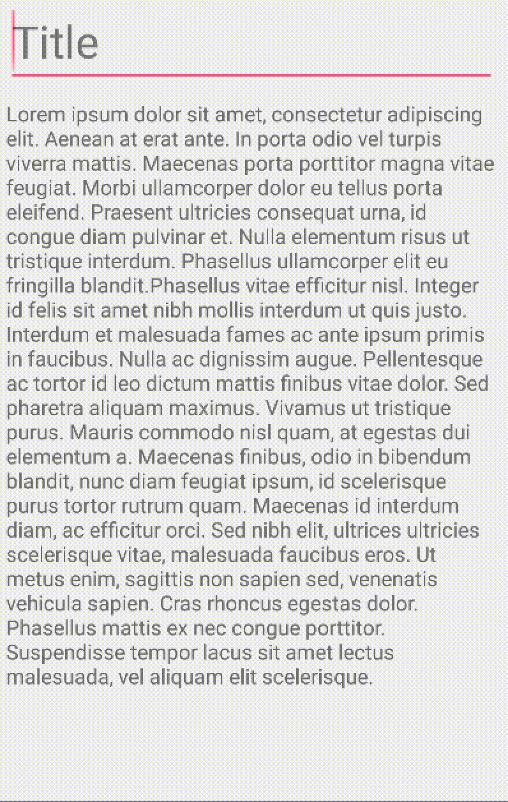

AutoscaleEditText
=================



AutosizeEditText for Android is an extension of native EditText that offer a smooth auto scale text size.

## Latest Version

[ ](https://bintray.com/txusballesteros/maven/AutoscaleEditText/_latestVersion) 

## How to use

### Configuring your project dependencies

Add the library dependency to your build.gradle file.

```groovy
dependencies {
    ...
    compile 'com.txusballesteros:AutoscaleEditText:1.0'
}
```

### Adding and Customizing the View

Add the view to your xml layout file.

```xml
<com.txusballesteros.AutoscaleEditText
        android:layout_width="match_parent"
        android:layout_height="wrap_content"
        android:textSize="30sp" />
```

Now you personalize some of custom parameters of the view.

* **animation Duration**: With this field you can establish the transformation duration in milliseconds, by default it's set to 300ms.

* **linesLimit**: You can use this attribute to set the approximate lines number when the view will triggers the text scale transformation, by default it's set to 2.

* **textScale**: Use this attribute to set the text scale percentage, I mean, if you have set your text size to 30sp and the text scale to 0.7 for example, when the user write a text and this overflows the line limit, the view change the textSize to 21sp or (30 * 0.7), by default it's set to 0.7 (70%).

```xml
<com.txusballesteros.AutoscaleEditText
        ...
        app:linesLimit="3"
        app:textScale="0.75"
        app:animationDuration="200" />
```

## Motivation of the Project

I created this view as a little piece of the [Redbooth](https://redbooth.com/) App for Android.

## License

Copyright Txus Ballesteros 2015 (@txusballesteros)

This file is part of some open source application.

Licensed to the Apache Software Foundation (ASF) under one
or more contributor license agreements.  See the NOTICE file
distributed with this work for additional information
regarding copyright ownership.  The ASF licenses this file
to you under the Apache License, Version 2.0 (the
"License"); you may not use this file except in compliance
with the License.  You may obtain a copy of the License at

  http://www.apache.org/licenses/LICENSE-2.0

Unless required by applicable law or agreed to in writing,
software distributed under the License is distributed on an
"AS IS" BASIS, WITHOUT WARRANTIES OR CONDITIONS OF ANY
KIND, either express or implied.  See the License for the
specific language governing permissions and limitations
under the License.

Contact: Txus Ballesteros <txus.ballesteros@gmail.com>